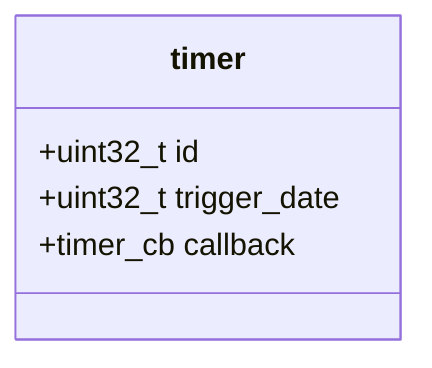

# README

## Objectif

> Écrire un driver `timer` qui permet à différents modules embarqués, d'exploiter une même horloge hardware, pour déclencher différentes actions à un instant précis.

## Exigences

Le module doît être :
1. mono-processus et mono-threadé
2. généraliste pour les différents modules
3. présenter des interfaces pour : insérer/supprimer un timer
4. pouvoir insérer autant de timer que possible

## Spécifications

* Lorsqu'un module `X` insère un timer, il définit la **durée** de ce dernier et une **callback** pour être averti de sa péremption. Le driver `timer` lui retourne un ID pour permettre au module `X` d'interroger ou supprimer ce timer.

* Lorsqu'un module `X` supprime un timer, il l'identifie par l'ID de ce dernier.

Ces opérations seront réalisées via ces trois interfaces documentées dans le code :
```C
uint32_t read_current_time();
uint8_t set_timer(const uint32_t duration, const timer_cb my_callback, uint32_t* id);
uint8_t remove_timer(const uint32_t id);
```


## Architectures

L'architecture se compose en trois élèments :
 - La structure timer
 - Le stockage et la gestion des timers
 - Le déclenchement des timers

### Structure timer

La structure du timer est présentée ci-dessous :


* L'`id` est un compteur incrémenté à chaque appel de la méthode `set_timer`.
* `trigger_date` est l'horodatage exacte du déclenchement de l'ISR, c.a.d la somme de
  * `duration` en paramètre de `set_timer`
  * `hw_clock` l'heure actuel de l'horloge


### Stockage et gestion des timers

Les `timers` seront stocké dans un ring buffer de taille X, il occupe donc statiquement : X * 12 octets.

Le choix du ring buffer a été réalisé pour respecter l'exigence n°4.

Pour faciliter leur gestion (déclenchement, péremption etc...), les timers seront stockés par en fonction de leur trigger_date par ordre croissant.

> La trigger_date la plus imminente sera toujours à la tête du ring buffer.

(un algo de tri sera nécessaire...)

### Déclenchement des timers

La contrainte est que le registre hw_trigger ne peut contenir qu'une seule et unique trigger_date. Cette dernière devra toujours être la trigger_date la plus iminente du ring buffer.

#### Cas limites identifiés
1. Entrée d'un nouveau timer avec une trigger_date plus imminente que celle inscrit dans le registre hw_trigger.
2. Stockage de plusieurs timers qui s'exécutent à exactement la même trigger date.

Pour répondre au cas limites (1.), les méthodes set et remove timer et l'interruption hw_trigger mettront systématiquement à jour le registre trigger_date. De plus, il sera impossible d'insérer une `trigger_date` >= `hw_clock`.

Pour répondre au cas limites (2.), lors de son exécution, l'interruption parcourt le ring buffer pour exécuter toutes les callbacks des timers qui sont périmés.

#### Limites de l'implémentation proposée
* Cette solution n'est pas optimale, car une interruption se doit d'être extrêment courte et donc éviter tout mécanisme de boucle.
* Dans le cas où une calback dure plusieurs secondes, les autres timers seront retardés.

# Plan d'implementation 

- [x] Environnement de dev
- [x] Implémentation d'une structure ring buffer
- [ ] Choix et implémentation d'un algo de tri
- [ ] Implémentation de set et remove timer
- [ ] Implémentation de l'ISR
- [ ] Implémentation d'une simulation (optionnel pour rigoler)
